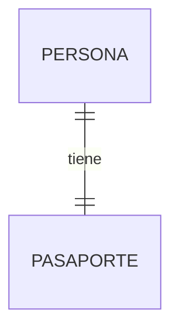
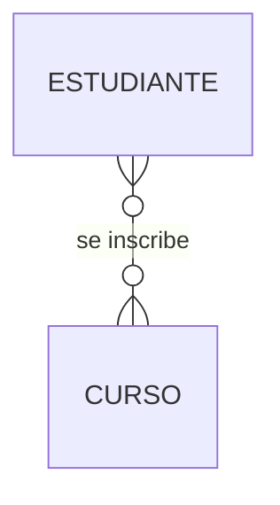
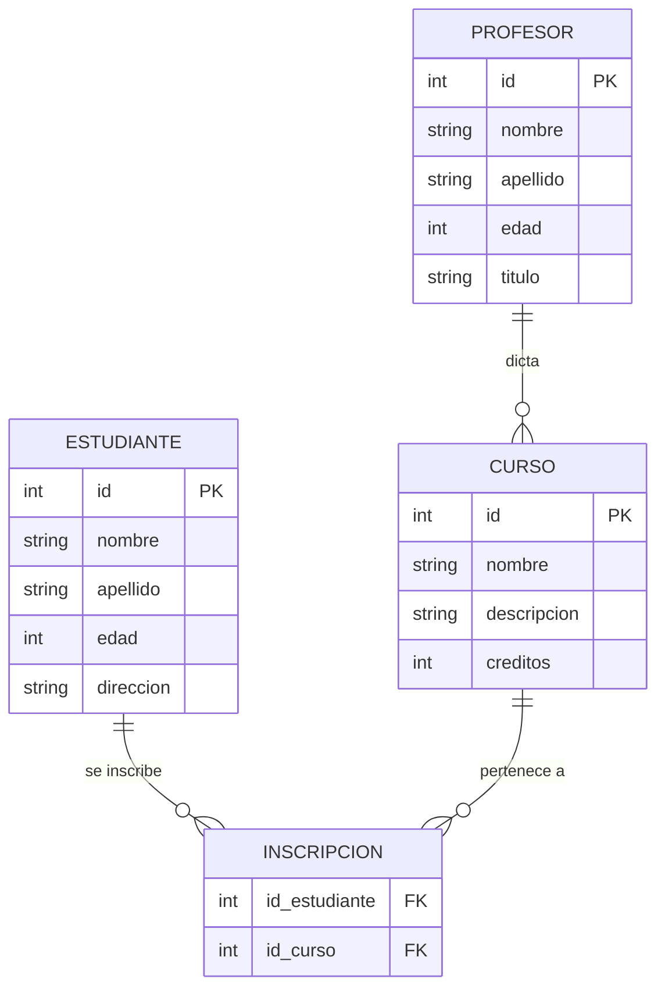

# Guía de Modelamiento de Bases de Datos

> Una guía práctica para estudiantes que están comenzando con bases de datos relacionales.

## Índice

1. [¿Qué es el modelamiento?](#1-qué-es-el-modelamiento)
2. [Identificación de Entidades](#2-identificación-de-entidades)
3. [Identificación de Atributos](#3-identificación-de-atributos)
4. [Identificación de Relaciones](#4-identificación-de-relaciones)
5. [Tipos de Relaciones](#5-tipos-de-relaciones)
6. [Normalización](#6-normalización)
7. [Ejemplo completo: Sistema académico](#7-ejemplo-completo-sistema-académico)

---

## 1. ¿Qué es el modelamiento?

Antes de crear una base de datos, necesitamos **planear** cómo va a estar organizada. A ese proceso lo llamamos **modelamiento**.

Piénsalo como hacer un plano antes de construir una casa: primero diseñas, luego construyes.

El modelamiento tiene 3 pasos principales:

```
Identificar entidades → Identificar atributos → Identificar relaciones
```

---

## 2. Identificación de Entidades

Una **entidad** es cualquier "cosa" importante que necesitamos guardar en la base de datos.

Puede ser una persona, un objeto, un evento o un concepto.

**¿Cómo identificar entidades?**
Pregúntate: *¿sobre qué necesito guardar información?*

| Ejemplo de problema | Entidades posibles |
|---|---|
| Sistema de una tienda | Cliente, Producto, Orden |
| Sistema universitario | Estudiante, Curso, Profesor |
| Sistema de biblioteca | Libro, Usuario, Préstamo |

> **Consejo:** Las entidades suelen ser **sustantivos** en la descripción del problema.

---

## 3. Identificación de Atributos

Los **atributos** son las características o propiedades de cada entidad. En la base de datos, los atributos se convierten en las **columnas de una tabla**.

**Ejemplo:**

La entidad `Estudiante` puede tener estos atributos:

```
Estudiante
├── id          <- identificador único (clave primaria)
├── nombre
├── apellido
├── edad
└── direccion
```

> **Consejo:** Siempre incluye un atributo `id` como identificador único. Esto se llama **llave primaria** o **Primary Key (PK)**.

---

## 4. Identificación de Relaciones

Las **relaciones** describen cómo se conectan las entidades entre sí.

**Ejemplo:**
- Un *estudiante* se inscribe en un *curso*
- Un *curso* es dictado por un *profesor*

Estas conexiones son las relaciones. En la base de datos, las relaciones se implementan usando **llaves foráneas (Foreign Key - FK)**.

---

## 5. Tipos de Relaciones

Existen 3 tipos de relaciones:

### Uno a Uno (1:1)

Una entidad A se relaciona con **exactamente una** entidad B.



Una persona tiene un solo pasaporte, y un pasaporte pertenece a una sola persona.

### Uno a Muchos (1:N)

Una entidad A se relaciona con **muchas** entidades B, pero cada B solo pertenece a una A.


Un profesor dicta muchos cursos, pero cada curso tiene un solo profesor.

### Muchos a Muchos (N:M)

Muchas entidades A se relacionan con muchas entidades B.



Un estudiante tiene muchos cursos, y un curso tiene muchos estudiantes.

> **Atención:** Las relaciones **N:M** requieren una **tabla intermedia** para implementarse en la base de datos.

---

## 6. Normalización

La **normalización** es el proceso de organizar bien la base de datos para:

- Evitar información repetida
- Reducir errores
- Facilitar el mantenimiento

**Regla de oro:** cada dato debe estar guardado en **un solo lugar**.

**Ejemplo de mala práctica (sin normalizar):**

| id_orden | cliente | email_cliente | producto |
|---|---|---|---|
| 1 | Juan | juan@mail.com | Laptop |
| 2 | Juan | juan@mail.com | Mouse |

El email de Juan está repetido. Si cambia, hay que actualizarlo en dos filas.

**Ejemplo correcto (normalizado):**

Tabla `clientes`:

| id | nombre | email |
|---|---|---|
| 1 | Juan | juan@mail.com |

Tabla `ordenes`:

| id | id_cliente | producto |
|---|---|---|
| 1 | 1 | Laptop |
| 2 | 1 | Mouse |

---

## 7. Ejemplo completo: Sistema académico

Vamos a modelar un sistema tipo **Banner** (sistema universitario).

### Paso 1 - Entidades

```
Estudiante | Curso | Profesor
```

### Paso 2 - Atributos

```
Estudiante          Curso               Profesor
├── id              ├── id              ├── id
├── nombre          ├── nombre          ├── nombre
├── apellido        ├── descripcion     ├── apellido
├── edad            └── creditos        ├── edad
└── direccion                           └── titulo
```

### Paso 3 - Relaciones

```
Estudiante  >────<  Curso   (N:M -> un estudiante tiene muchos cursos y viceversa)
Profesor     ────<  Curso   (1:N -> un profesor dicta muchos cursos)
```

### Paso 4 - Diagrama



---

## Resumen del proceso

```
1. Leer el problema
2. Identificar entidades (sustantivos importantes)
3. Definir atributos de cada entidad
4. Identificar relaciones entre entidades
5. Determinar el tipo de relación (1:1, 1:N, N:M)
6. Normalizar para evitar redundancias
7. Implementar en la base de datos
```

---

*Guía elaborada para el curso de Bases de Datos - Ingeniería Telemática.*