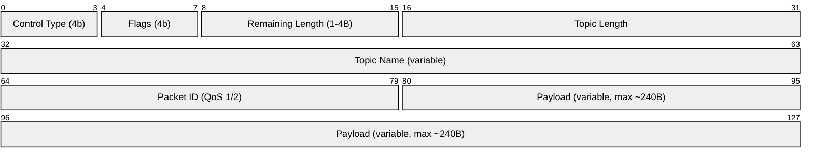

# MQTT
MQTT (Message Queuing Telemetry Transport) es un protocolo de mensajería ligero basado en el modelo publicador-suscriptor, diseñado originalmente para entornos con recursos limitados y conexiones poco confiables, como redes industriales o dispositivos IoT. En lugar de comunicación directa entre dispositivos, todos los mensajes pasan por un intermediario llamado broker, que se encarga de recibir los mensajes de los publicadores y distribuirlos a los suscriptores que hayan registrado interés en un topic específico. Su bajo overhead, la simplicidad de su protocolo y el soporte para distintos niveles de calidad de servicio (QoS 0, 1 y 2) lo han convertido en el estándar de facto para la comunicación en ecosistemas IoT.

# Anatomía del mensaje MQTT


El paquete MQTT se divide en tres secciones principales. El Fixed Header es el único campo obligatorio en todos los paquetes: sus primeros 4 bits identifican el tipo de control (CONNECT, PUBLISH, SUBSCRIBE, etc.) y los siguientes 4 bits son flags que varían según el tipo; le sigue el campo Remaining Length que indica cuántos bytes vienen después. El Variable Header contiene el nombre del topic y, cuando se usa QoS 1 o 2, un Packet Identifier para rastrear la entrega. Finalmente el Payload es el mensaje en sí, con tamaño variable hasta el límite del buffer, que en PubSubClient son ~240 bytes útiles descontando las cabeceras.

# Conexión a MQTT Server SIN SSL

Para usar este código necesitará PubSubClient de Nick O'Leary
https://github.com/knolleary/pubsubclient

```c++
#include <Arduino.h>
#include <WiFi.h>
#include <PubSubClient.h>

// Configuración de la red Wi-Fi
const char* ssid = "PUBLICA";
const char* password = "";

// Configuración del servidor MQTT
const char* mqttServer = "broker.emqx.io";
const int mqttPort = 1883;
const char* clientName = "ESP32ClienteIcesi001";

// Configuración del topic
const char* topic = "icesi/integrador";

// Objeto WiFiClient
WiFiClient wifiClient;

// Objeto PubSubClient
PubSubClient mqttClient(wifiClient);

void callback(char* topic, byte* payload, unsigned int length) {
  // Imprime el mensaje recibido
  Serial.print("Mensaje recibido en el topic ");
  Serial.print(topic);
  Serial.print(": ");
  for (int i = 0; i < length; i++) {
    Serial.print((char)payload[i]);
  }
  Serial.println();
}

void keepAlive(){
  if (!mqttClient.connected()) {
    Serial.println("Reconectando");
    // Intenta conectarse al servidor MQTT
    while (!mqttClient.connected()) {
      Serial.println("Intentando conectar al servidor MQTT...");
      if (mqttClient.connect(clientName)) {
        Serial.println("Conectado al servidor MQTT!");
      } else {
        Serial.print("Error al conectar: ");
        Serial.println(mqttClient.state());
        delay(5000);
      }
    }
    mqttClient.subscribe(topic);
  }
}

void setup() {
  // Inicializa la comunicación serial
  Serial.begin(115200);

  // Conecta a la red Wi-Fi
  WiFi.begin(ssid, password);
  while (WiFi.status() != WL_CONNECTED) {
    delay(500);
    Serial.print(".");
  }

  // Inicializa el cliente MQTT
  mqttClient.setServer(mqttServer, mqttPort);
  mqttClient.setCallback(callback);

  // Intenta conectarse al servidor MQTT
  while (!mqttClient.connected()) {
    Serial.println("Intentando conectar al servidor MQTT...");
    if (mqttClient.connect(clientName)) {
      Serial.println("Conectado al servidor MQTT!");
    } else {
      Serial.print("Error al conectar: ");
      Serial.println(mqttClient.state());
      delay(5000);
    }
  }

  // Suscríbete al topic
  mqttClient.subscribe(topic);
}


void loop() {
  // Procesa los mensajes del servidor MQTT
  mqttClient.loop();
  keepAlive();
}


void serialEvent() {
  if (Serial.available() > 0) {
    String data = Serial.readStringUntil('\n');
    mqttClient.publish("test/101/beta", data.c_str(), 1);
  }
}
```

# Broker

El broker MQTT al que nos conectaremos es

```
https://www.emqx.com/en/mqtt/public-mqtt5-broker
```

Allí verá los parámetros de conexión

| Parámetro  | Valor |
| ------------- | ------------- |
| Broker | broker.emqx.io |
| TCP Port | 1883 |
| WebSocket Port | 8083 |
| SSL/TLS Port | 8883 |
| WebSocket Secure Port | 8084 |
| QUIC Port | 14567 |


# Cliente web de MQTT

Puede conectarse a esta página para ensayar el protocolo de telemetría

<a href="https://mqttx.app/web-clien">mqttx.app/web-client<a>
